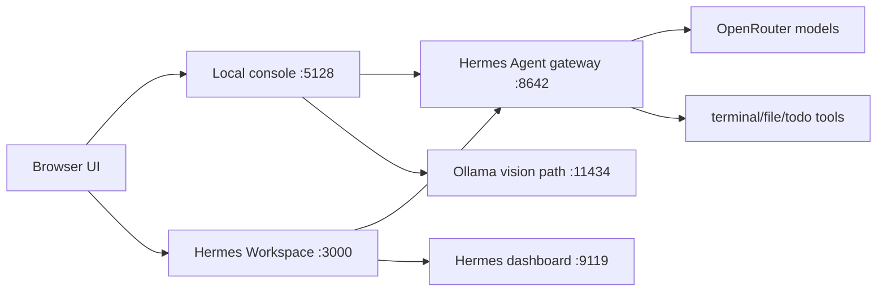

# Operations and troubleshooting

## Mental model



## Auth path

Hermes Agent gateway requires `API_SERVER_KEY` from `~/.hermes/.env`.
Hermes Workspace expects that same value as `HERMES_API_TOKEN` or `CLAUDE_API_TOKEN`.
The included `scripts/start-hermes-workspace.sh` reads `API_SERVER_KEY` without sourcing the full `.env` file, then exports the names Workspace expects.

## 401 from Workspace or stuck Thinking state

Check token propagation:

```bash
PID=$(launchctl list | awk '/dev.hermes.workspace/{print $1; exit}')
ps eww -p "$PID" | tr ' ' '\n' | grep -E 'HERMES_API_TOKEN|CLAUDE_API_TOKEN|HERMES_API_URL|HERMES_DASHBOARD_URL'
```

Then login and verify API stream manually:

```bash
PASS=$(grep '^HERMES_PASSWORD=' ~/hermes-workspace/.env | cut -d= -f2-)
COOKIE=$(mktemp)
curl -c "$COOKIE" -s http://127.0.0.1:3000/api/auth \
  -H 'Content-Type: application/json' \
  -d "{\"password\":\"$PASS\"}"

curl -b "$COOKIE" -s http://127.0.0.1:3000/api/send-stream \
  -H 'Content-Type: application/json' \
  -d '{"sessionKey":"ops-smoke","friendlyId":"ops-smoke","message":"Use terminal tool to run: pwd. Reply with only the output."}'
```

## OpenRouter credit or stale exhaustion state

If OpenRouter says credentials are exhausted even after you topped up credits:

```bash
npm run reset:openrouter
launchctl kickstart -k gui/$(id -u)/ai.hermes.gateway
```

Check credits:

```bash
KEY=$(grep '^OPENROUTER_API_KEY=' ~/.hermes/.env | cut -d= -f2-)
curl -s https://openrouter.ai/api/v1/credits -H "Authorization: Bearer $KEY" | python3 -m json.tool
```

## Restart all services

```bash
for label in ai.hermes.gateway dev.hermes.local-dashboard dev.hermes.workspace dev.hermes.local-console; do
  launchctl kickstart -k "gui/$(id -u)/$label"
done
```

## Stop all services

```bash
for label in ai.hermes.gateway dev.hermes.local-dashboard dev.hermes.workspace dev.hermes.local-console; do
  launchctl bootout "gui/$(id -u)/$label" 2>/dev/null || true
done
```

## Logs

```bash
tail -f ~/.hermes/logs/gateway.log
tail -f ~/.hermes/logs/gateway.error.log
tail -f ~/.hermes/logs/hermes-dashboard.err.log
tail -f ~/.hermes/logs/hermes-workspace.err.log
tail -f logs/local-console.err.log
```
